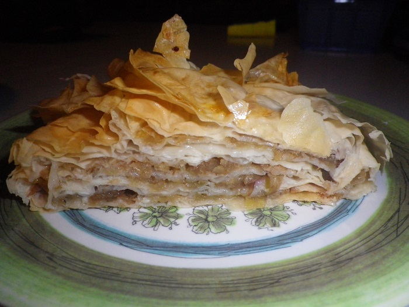

# Apple Strudel

These are Baka's really yummy apple strudel.

## Ingredients

* 2 green apples
* 2 golden apples
* 2 red apples 
* Filo pastry
* 1 packet sultanas
* breadcrumbs
* butter
* cinnamon
* Oil
* Sugar \(brown\)
* Vanilla sugar

## Cooking instruction

1. Preheat oven at 180 degrees.
2. Place a tea towel on kitchen bench.
3. Place 2 sheets of filo on tea towel and brush with oil.
4. Keep adding 2 sheets, brush with oil.
5. Repeat until you have around 8 sheets.
6. Add grated apples, breadcrumbs, cinnamon, sultanas, sugar to the pastry. 
7. Roll the filo pastry up \(use tea towel to assist\). Keep brushing with ½ oil & ½ melted butter mixture as you roll each part.
8. Rub oil on base of tray and sprinkle bread crumbs on base.
9. Place filo in tray and place in oven \(increase to 200 degrees\). Bake for 40 mins.
10. Turn tray after 20 minutes \(and brush a bit more melted butter on top\)

