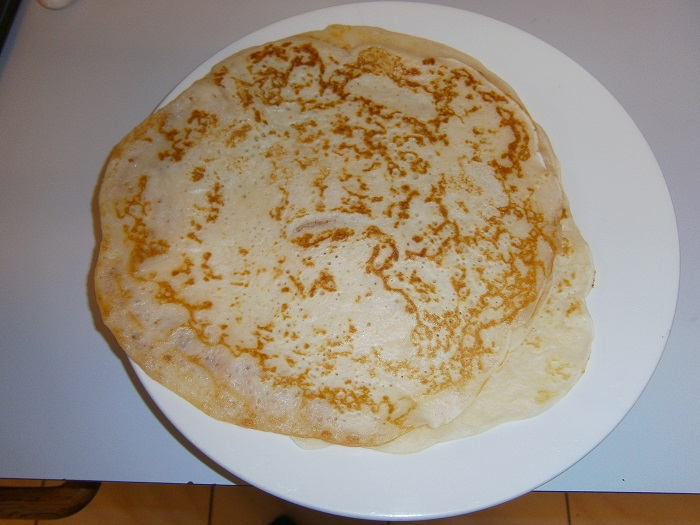

# Palacinka

These healthy banana pancakes are easy and great way to start the day. Traditionally served mixed berries or whatever else you like.

## Ingredients

* 2 cups of plain flour
* 1 tbsp baking powder
* 1 tbsp. oil
* 1 cup milk
* 1 ripe banana
* Cooking salt
* 1 egg
* Cinnamon sugar 

## Cooking instruction

1. Mix all ingredients in a bowl and leave in the fridge overnight.
2. Add a little oil to a fry pan and swirl each time prior to adding pancake mixture.
3. Add a cup of pancake mixture and spread mixture by moving the fry pan around gently.
4. Heat 1 side for a minute and then turn using a spatula.  Second side is usually quicker.

