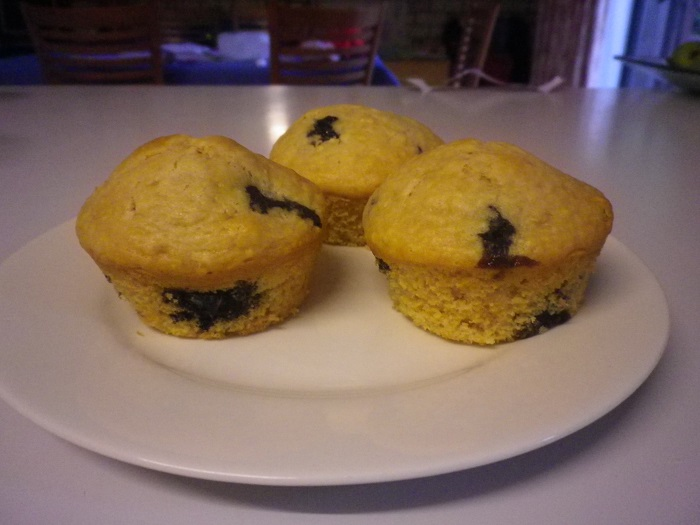

# Blueberry Muffins

These sensational blueberry muffins make a perfect morning or afternoon tea treat.

## Ingredients

* 2 ¼ cups self-raising flour, sifted
* 100g butter, melted, cooled
* 2 eggs, lightly whisked
* 150g fresh or frozen blueberries
* 1/2 cup caster sugar
* 2/3 cup milk
* 1 teaspoon vanilla extract
* 60g cream cheese into 12 cubes

## Cooking instruction

1. Preheat oven to 200°C. Lightly grease a 12-hole 1/2-cup capacity muffin pan.
2. Combine flour and sugar in a bowl. Make a well in the centre.
3. Whisk butter, milk, egg and vanilla in a jug. Pour into well. Add blueberries and gently fold until just combined. Half fill muffin holes with mixture. Top each muffin with a cream cheese cube and 1/2 teaspoon jam and cover with remaining mixture.
4. Bake muffins for 15 to 20 minutes or until a skewer inserted into the top half of muffins comes out clean. Stand in pan for 5 minutes. 
5. Turn muffins onto a wire rack to cool slightly. Serve warm.

