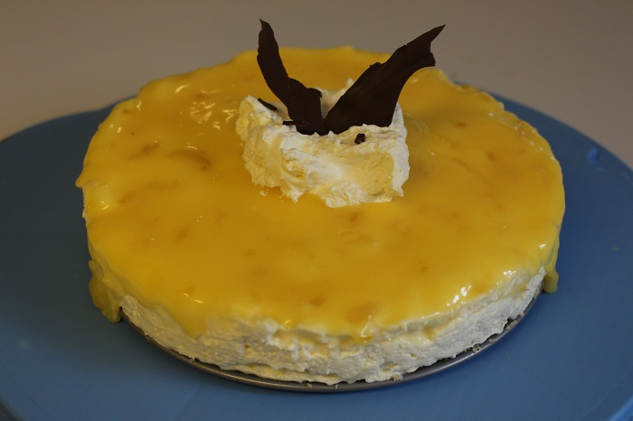

# Cheescake

## Ingredients

* 250g Arnott's Nice Biscuits 
* 125g Unsalted Butter, Melted
* 1/4 Cup Boiling Water
* 3 tsp. Gelatine Powder
* 2x 250g  Cream Cheese
* 2/3 Cup Caster Sugar
* 500ml Thickened Cream
* 2 Egg Whites

### Lemon Curd

* 100g Unsalted Butter 
* 1 1/2 Cup, Caster Sugar
* 1 tsp. Finely grated Lemon Rind
* 1/3 Cup, Lemon Juice
* 2 eggs, lightly beaten

## Cooking instruction

1. Process Biscuits in blender until finely crushed. 
2. Add butter until well combined. Press mixture into base of cake tin. Refrigerate for about  30 minutes or until hard. 
3. Put 1/4 C of  boiling water in mug. Sprinkle 3 TSP of Gelatine powder and stir until sugar dissolves. Rest for about 2-3 minutes.
4. Beat Cream Cheese and Sugar in bowl until well combined.  Add lemon juice \(optional\)
5. Beat cream in separate bowl.
6. Beat egg whites. 
7. Fold Gelatine, egg whites and cream into mixture. 
8. Spoon half mixture into bowl. Add  lemon curd and stir to create ripple effect. Repeat for rest of mixture. Refrigerate overnight or 2-3 hrs. serve with cream , chocolate and lemon curd on top.   

   **Lemon Curd**

9. Add butter, sugar, lemon juice and rind in heatproof bowl over simmering water.  
10. Stir until sugar dissolves. Wisk in egg whites. 
11. Cook until mixture thickens. 8-10 minutes. 

