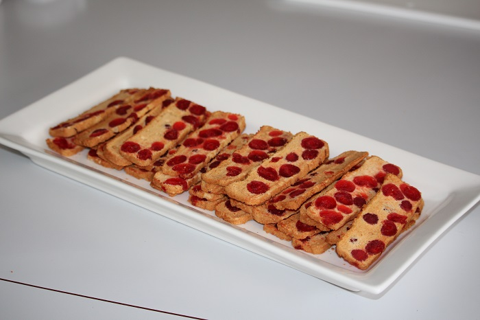

# Cherry and Almond biscuits

These are Nannas really yummy cherry and almond biscuits. Great at Xmas time.

## Ingredients

* 3 egg whites                       
* 1/3 cup caster sugar
* 125g almonds                       
* 125g glazed cherries                
* 2/3 cup plain flour   
* 1/2 teaspoon cream of tartar             

## Cooking instruction

1. Beat 3 egg whites until stiff.  
   Egg white stif peak tip: take eggs out of fridge early and add a 1/2 teaspoon of cream of tartar before beating at medium speed.
2. Gradually fold 1/3 cup caster sugar.
3. Gently stir in 2/3 cup plain flour.
4. Stir in 125g almonds and 125g glazed cherries.
5. Put in a greased loaf tin and bake in a moderate oven (180 deg.) for approx 25 mins or until the top is firm and slightly brown.
6. Take from tin and cool.
7. Then wrap in foil and place in refrigerator for 24 hrs.
8. Slice thinly with a sharp knife.
9. Spread on flat pizza tray and bake in a low (120 deg.) oven for 5 minutes each side so not to let them brown too much. Keep an eye on this process.

