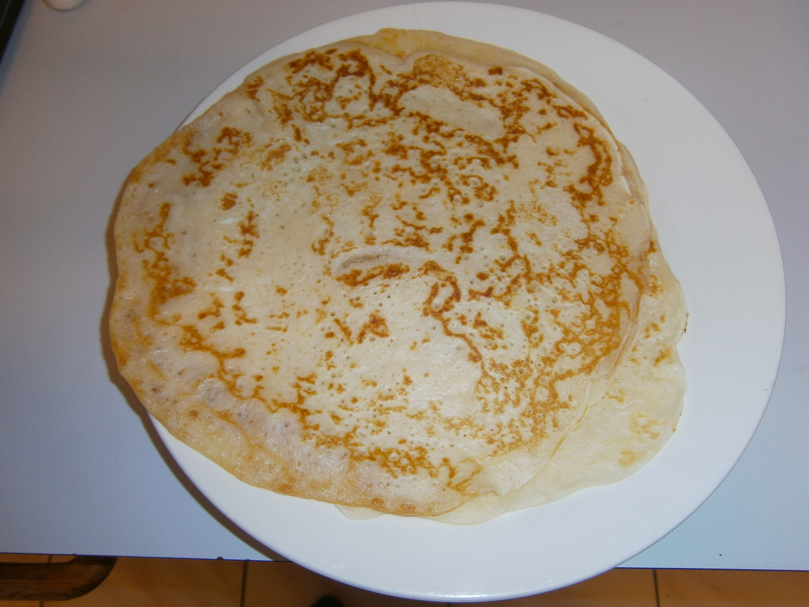

#Palacinka (crepes)
Have fun flipping the pancakes.  Traditionally served with butter and jam, or brown sugar & lemon.  

## Ingredients
- 2 cups of plain flour
- 1 tbsp. oil
- 3 cups milk
- Cooking salt
- 1 egg
- Vanillin sugar 

## Cooking instruction
1. Mix all ingredients in a bowl and leave in the fridge overnight.
1. Add a little oil to a fry pan and swirl each time prior to adding pancake mixture.
1. Add a cup of pancake mixture and spread mixture by moving the fry pan around gently.
1. Heat 1 side for a minute and then turn using a spatula.  Second side is usually quicker.

