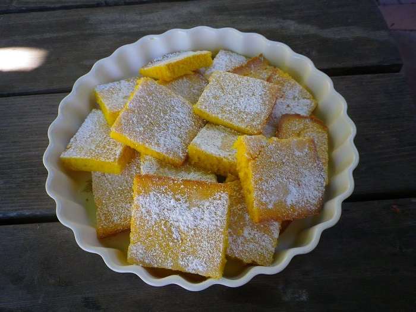

# Pumpkin Slice

## Ingredients

* 75g butter
* 2 eggs
* ½ cup sugar 
* pumpkin
* 1 cup sultanas \(optional\)
* 1 ½ cup self raising flour

## Cooking instruction

1. Boil pumpkin pieces and let cool for ½ hour.
2. Preheat oven at 180 degrees.
3. Cream butter and sugar and eggs \(use electric beater\).
4. Add 1 ½ cups mashed pumpkin to mixture.
5. Add self raising flour and continue to mix with beater.
6. Rub butter on base of 20cm shallow baking tin.
7. Pour and spread pumpkin mixture in tin
8. Place in oven for approx 1 hour.
9. Remove from oven , and let cool for a few minutes.
10. Sprinkle icing sugar and slice up.

