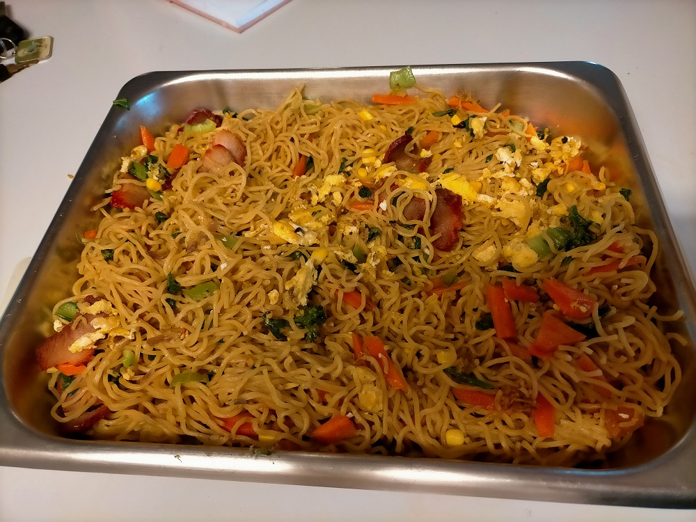

# Vietnamese Noodle Stir Fry

These are Tam and Luan's amazingly delicious Vietnmese Noodles stir fry. 

## Ingredients

* 375g Fresh Egg Noodles (\from asian grocer fridge section \)
* BBQ Pork (\from asian grocer fridge section \)
* chopped ginger
* 2 table spoons Hoisin sauce
* 1 eggs \(1 in mixture, 1 for glue\)
* Peanut Oil for stir frying
* 2 arge carrots \(grated\)
* ½ onion
* 1 Brochelini
* 1 Bok Choy 
* corn kernals

## Cooking instruction

1. Remove Fresh Egg Noodles from packet, place in microwave bowl and zap for 4 minutes on medium setting. This takes mositure out of the noodles.
2. Place  noodles into saucepan of boiling water.   Sitr with choptsick for 2 minutes until to cook noodles. Do not over cook.
3. Strain noodles and rinse immediatley under cold water while in strainer.  Set strainer aside to let noodles dry a bit while you start chopping other ingredients.   
4. Finely chop all ingredients, 
5. Do egg omlette first in wok and set aside,
6. Stir fry other ingredients in peanut oil,
7. Add hoisin sauce, then add noodles to finish and stir it all through.