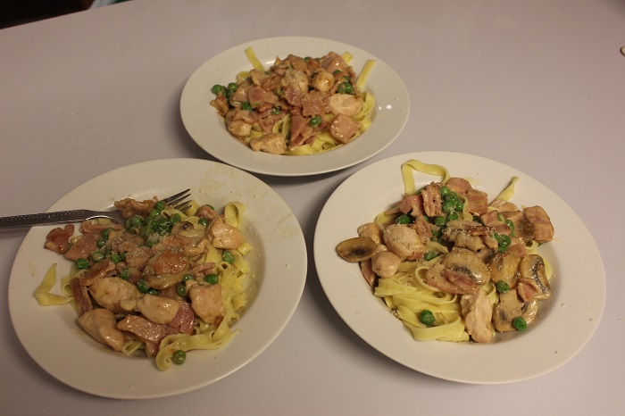

# Fettuccine Carbonara

## Ingredients

* Fettuccine pasta
* mushroom
* butter
* parmesan cheese 
* Bacon & chicken tenderloins
* Red wine
* ½ cup cream
* peas

## Cooking instruction

1. Sauté sliced mushrooms with butter in a fry pan.
2. Add chopped bacon.
3. Add 1 cup red wine. \(bring to boil\)
4. Add ½ cup cream, pepper and stir in.
5. Add ½ teaspoon corn flour mixed in a small amount of water to the pan.
6. Add to cooked fettuccine and sprinkle parmesan cheese.

