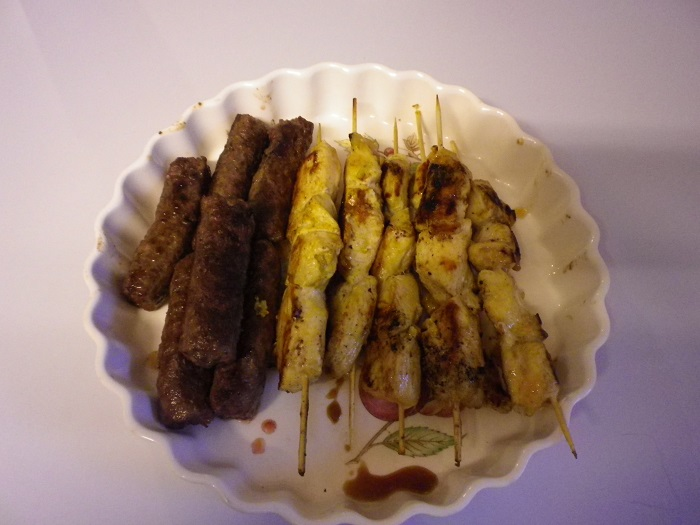

# Cevapcici

This is the traditional home made recipe, but the supermarket shop cevapi are pretty damn good. Great for a BBQ.

## Ingredients

* 500g beef mince
* 500g pork mince
* Garlic
* Sweet Hungarian paprika
* ground black pepper
* vege oil
* 1 teasp. Parsley flakes
* ¾ tabsp.cooking salt
* lemon

## Cooking instruction

1. Mix parsley flakes, garlic, pepper & mince in a bowl.
2. Add paprika a 1 large spoon of vegetable oil.
3. Squeeze lemon into the mixture and add cooking salt.
4. Mix well & leave to marinate for 1 hour.
5. Make small sausages from the mixture.

