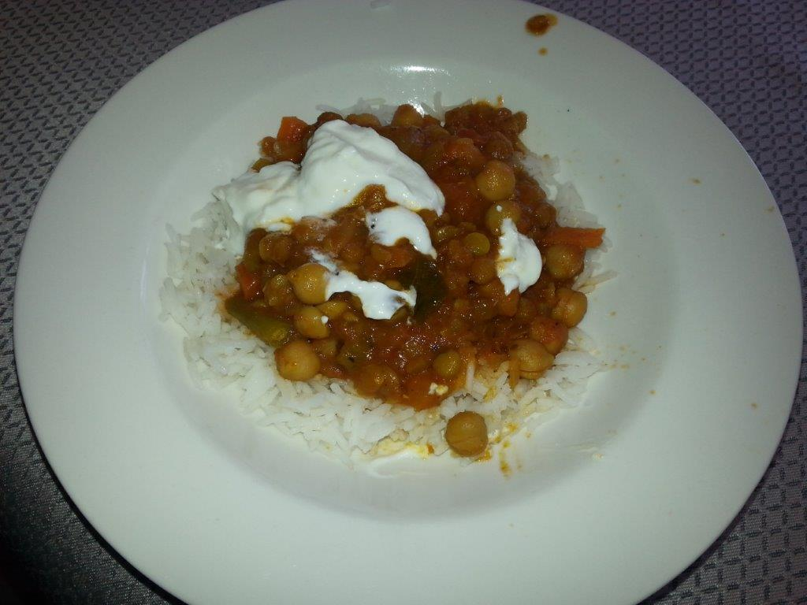

#Chickpea and Dahl Curry
This is so easy, so healthy and so yummy.

##Ingredients 
- 1 can chickpeas
- 1 can chopped tomotoes
- 2 handful yellow spit dahl/green lentils
- 1 tbsp. coriander
- 1 tbsp. turmeric
- 1 tbsp cummin powder
- 1/2 tsp chilli powder
- 1 tomatoes diced
- 2 tbsp. Curry powder
- 1 red onion
- 2 cloves garlic
- 3 table spoons ghee
- 1 tbsp. Ginger chopped
- natural yogurt
- rice 

## Cooking instruction
1. Saute Crushed fresh garlic, chooped ginger and onion in sausepan with ghee (or oil).
1. Add cummin powder, coriander powder, tumeric and mix in.
1. Drain and add chickpeas and stir in.
1. Add diced tomato and 1 can chopped tomatoes and stir in.
1. Add curry powder and mix in.
1. Add 2 handfuls of split dahl or green lentils.  
1. Add 1/2 cup of water. 
1. slowly simmer for 10 mins.
1. turn stove of and leave lid on for 15 minutes to allow lentils to cook through
1. Serve with steamed rice.
1. Add a big dollop of natural yogurt to take this curry to another level.
