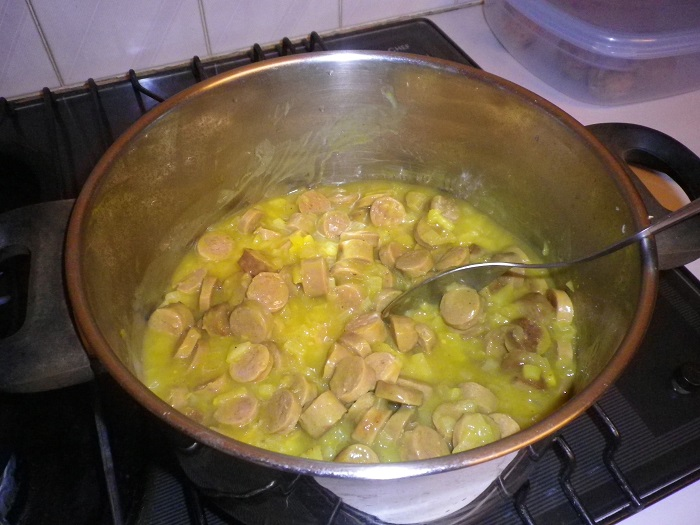

#Curried Sausages
These are fantastic served on a bed of mashed potatoes.   

## Ingredients
- 1 kg pork/beef sausages
- 3 tablespoons vinegar
- 1 cooking apple
- 1.5 teaspoons curry powder
- 0.25 teaspoon mixed herbs
- 2 chicken stock cubes
- 0.25 cup extra water
- 1 teaspoon salt
- 2 onions
- 3 tablespoons butter
- 0.5 teasp salt, pinch pepper
- 2.5 cups water
- 2 tablespoons flour
 
## Cooking instruction
1. Place sausages in a saucepan, cover with cold water and add salt and vinegar
1. Cover and bring to the boil. Reduce heat and simmer for 10 minutes. Drain.
1. Peel and finely chop onions and apple.
1. Melt butter in a frying pan and sauté onions and apple for 5 minutes.
1. Add curry powder, salt, pepper and mixed herbs.
1. Stir over heat for 3 minutes.
1. Gradually add water and crumbled stock cubes and bring to the boil, stirring all the time.
1. Remove skins from sausages and add sausages to sauce. Reduce heat and simmer for 10 minutes.
1. Blend flour and extra water, add to curry and stir until sauce boils and thickens
1. Serve with hot rice
1. Serves 4-6 

