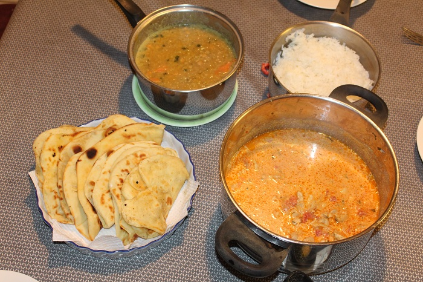

# Dahl

## Ingredients

* 250g yellow spit peas/lentils
* 1 tbsp. coriander leaves
* 1 tbsp. turmeric
* 1 tbsp cummin seeds
* 5 curry leaves
* 1/2 tsp chilli powder
* 2 dried whole chillies
* 2 tomatoes diced
* 1 tsp. Black mustard seed
* 2 cloves garlic
* 3 table spoons ghee
* 1 tomato 
* 1 tbsp. Ginger chopped

## Cooking instruction

1. Wash split peas in running water and add to saucepan of water. Add a table spoon of tumeric and slowly simmer for 45 mins.
2. Crush fresh garlic and ginger with a pich of salt \(the salt helps to soften\) to make a paste.
3. Heat 5 tbsp oil in small wok.  
4. To oil, add black mustard seed, cumin seeds, 2 dried chillies, chiili powder & 5 curry leaves \(careful these will splutter\).
5. Add garlic/ginger paste to oil and stir in.
6. Add wok contents to dahl saucepan and stir in.
7. Add 1 chopped tomato & simmer for 5 mins.
8. Add fresh coriander leaves to saucepan.

