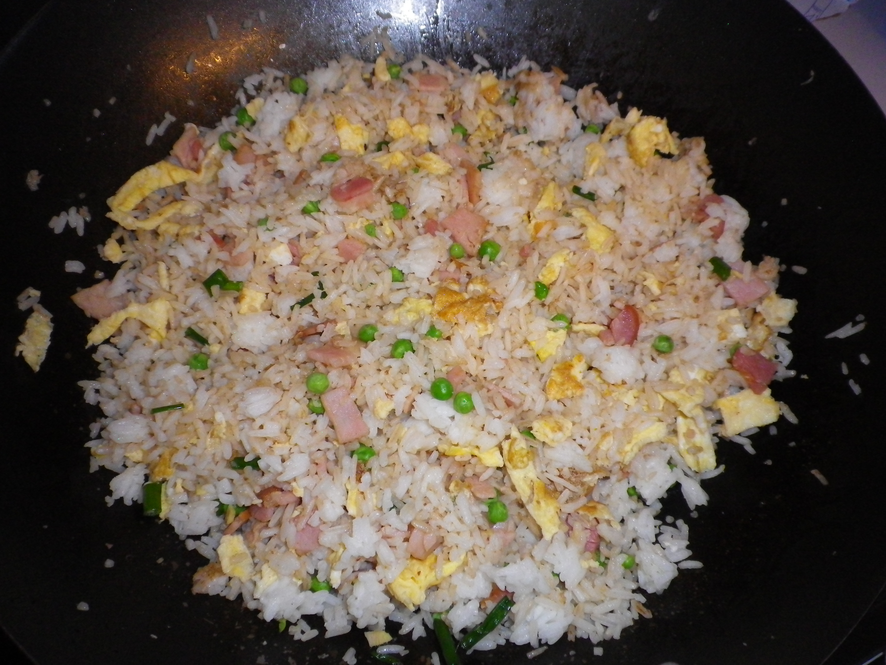

#Fried Rice

## Ingredients
- Long grain rice
- 2 eggs
- Shallots
- Frozen peas
- 3 rashes bacon or ham
- 2 teaspoons grated ginger
- Soy sauce

## Cooking instruction
1. Cook rice. Drain under cold running water to remove starch. Spread rice in a flat tray and leave in fridge overnight.
1. Beat each egg and cook 2 omelets in a wok and set aside. Cut into strips.
1. Heat small oil in wok and add grated ginger and bacon.
1. Add chopped shallots, rice, frozen peas and a small amount of soy sauce. Mix all ingredients.
1. Add egg strips towards the end and mix in.

