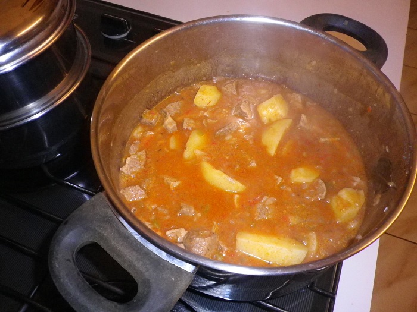

# Goulash

## Ingredients

* 500g diced veal
* 1 onion
* ¼ red capsicum
* 1 bay leaf
* Italian cooking sauce \(Bertolli\) 
* 2 potatoes
* 1 garlic
* tomato paste
* Hungarian sweet paprika
* Italian herbs

## Cooking instruction

1. Finely chop onion, garlic, red capsicum and sauté with oil in a large saucepan.
2. Add diced veal and stir until meat goes brown.
3. Add 2 big spoons of tomato paste & stir.
4. Add 1 cup of Italian cooking sauce & stir.
5. Add 2 -3 cups of water & stir.
6. Add pepper, paprika, Italian herbs & bay leaf.
7. Add large chopped potatoes.
8. Cover saucepan with lid and simmer for 20 minutes.
9. Add 1 tablespoon flour into a small cup and add a small amount of water & stir into a paste. Add to saucepan.
10. With a fork mash 1 or 2 of the cooked potatoes in the saucepan as this adds texture to the sauce.

