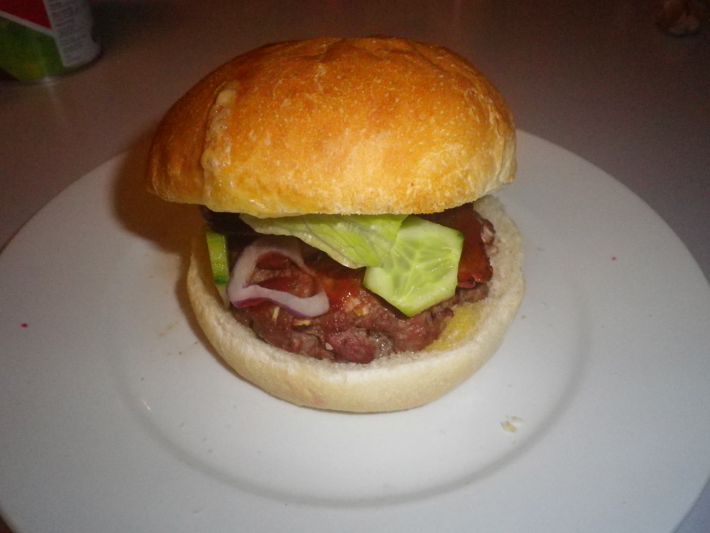

#Hamburger

## Ingredients
500g beef mince
1 red onion
1 tbsp. ground coriander
1 heaped tsp Dijon mustard
1 egg
1 hand full breadcrumbs
1 pinch ground cumin seeds
Salt & pepper

## Cooking instruction
1. Preheat oven to 230 degrees.
1. Mix and scrunch all ingredients in a bowl.
1. Mold and pack into hamburger patties.
1. Place in oven for 25 minutes.
1. Melt cheese on top at the end.
1. Serve in a grilled bun with favorite salads.
