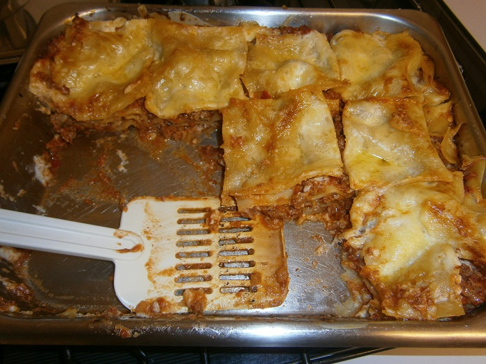

# Lasagna

## Ingredients

* spaghetti Bolognese sauce
* plain flour
* tomatoes
* parmesan cheese
* nutmeg
* milk
* cheese
* lasagna pasta
* butter

## Cooking instruction

1. Use left over Bolognese sauce from previous recipe.

### cheese sauce

1. Melt 50 g butter in a saucepan on low heat. Add a big wooden spoon of plain flour. Stir in.
2. Slowly add 2 cups of milk stirring continuously.
3. Bring to boil until cheese sauce thickens.
4. Add a tiny bit of nutmeg at the end.
5. Add a layer of meat sauce on base of tray.
6. Add pasta sheet, meat sauce, cheese sauce
7. Top layer -, add cheese sauce, slice tomatoes and parmesan cheese.
8. Place in oven \(180 degrees\) for 45 minutes.

