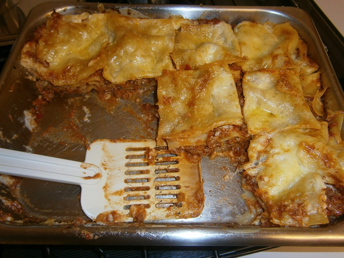

#Lasagna  

## Ingredients
spaghetti Bolognese sauce
plain flour
tomatoes
parmesan cheese
nutmeg
milk
cheese
lasagna pasta
butter

## Cooking instruction
1. Use left over Bolognese sauce from previous recipe.

###cheese sauce
1. Melt 50 g butter in a saucepan on low heat. Add a big wooden spoon of plain flour. Stir in.
1. Slowly add 2 cups of milk stirring continuously.
1. Bring to boil until cheese sauce thickens.
1. Add a tiny bit of nutmeg at the end.
1. Add a layer of meat sauce on base of tray.
1. Add pasta sheet, meat sauce, cheese sauce
1. Top layer -, add cheese sauce, slice tomatoes and parmesan cheese.
1. Place in oven (180 degrees) for 45 minutes.
