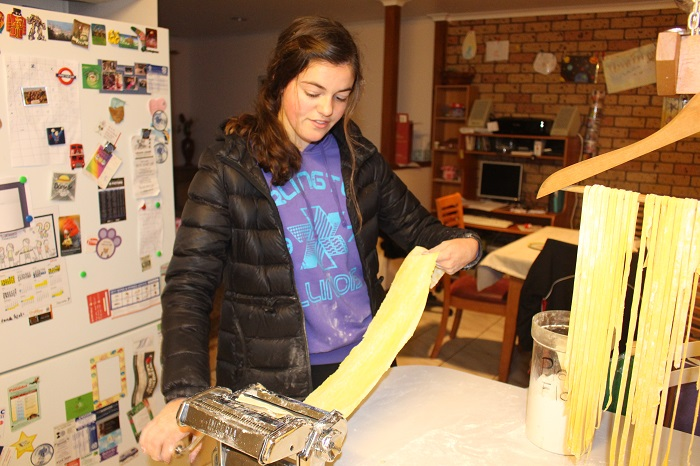

# Home Made Pasta

Home made pasta is easy and great fun to make. Kids love getting their hands icky and using the pasta machine.

## Ingredients

* 1 cup flour , 1 cup Semolina
* Salt
* 2—3 eggs
* 1 tbsp.  water

## Cooking instruction

1. Place flour in a large bowl and make a well in the middle and add the eggs.  
2. Use a fork to break up the eggs and bring in the flour unitl you have a dough you can work with your hands.  Add a small drizzle of olive oil to assist.
3. Knead until you have a smooth silky  and elastic dough. Use a small amount of water to assist.
4. Wrap the ball of dough in cling wrap and place in fridge for an hour.
5. Divide the dough in smaller balls and run though the pasta machine.
6. Flatten the dough and run through the thickest setting on you machine. 
7. Fold in half each time and dust each side with flour.
8. Usually 5 or 6 times moving the setting each time. 
9. Hang finished pasta on a coat hanger.

