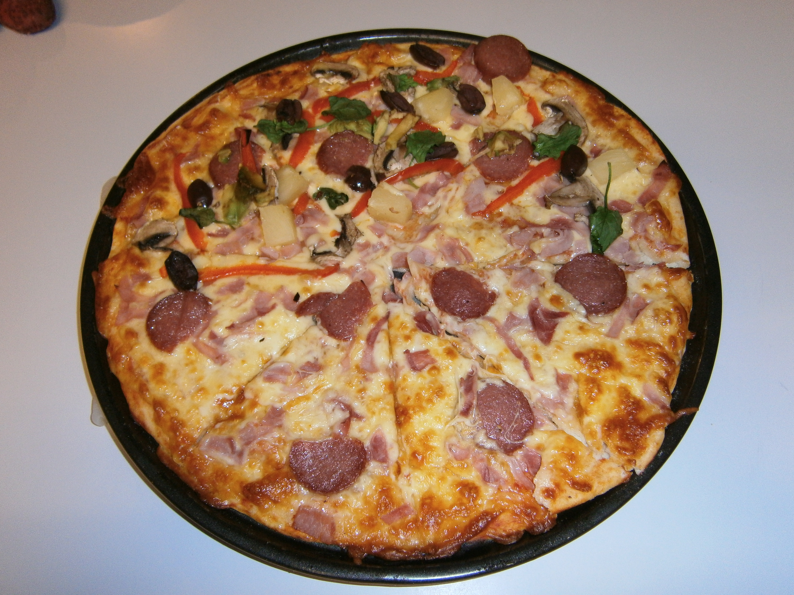

#Home Made Pizza
Pizza base is made in our bread maker. This is our Sunday night favorite.    

## Ingredients
200 ml water
1 teaspoon salt
1 ¾ teaspoon tandaco yeast
1 tbsp. olive oil
2 ½ cups bread flour

## Cooking instruction
1. Add pizza dough ingredients and set to pizza dough setting.  Our bread maker kneads it and gives you pizza dough in 50 minutes.
1. Put dough in a bowl, cover with cling wrap and leave in a sunny spot near a window for a few hours to rise.
1. Divide into 3balls, roll pizza dough on a floured bench top.
1. Spread Italian cooking sauce, mozzarella cheese and your favorite topping.
1. Cooked in hot oven (220c) for 20 minutes.

