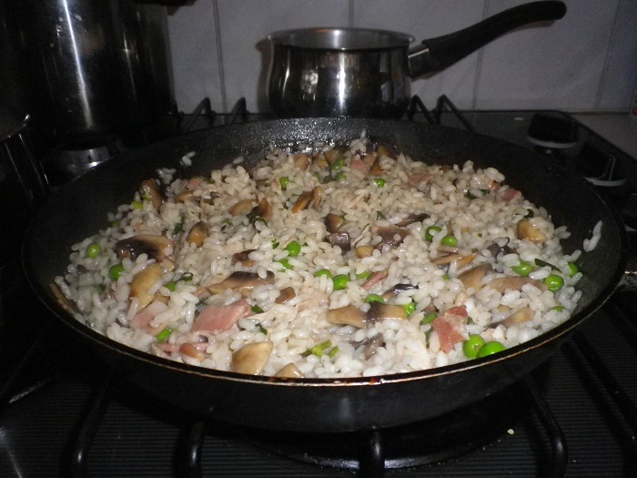

# Risotto

You can’t beat a creamy risotto, and yet another good use of excess chicken stock.

## Ingredients

* Arborio risotto rice
* chicken stock \(previous recipe\)
* shallots
* Salt & Pepper
* bacon rashes
* Mushrooms
* frozen peas

## Cooking instruction

1. Use the chicken stock from the previous recipe.
2. Melt butter in a fry pan and sauté mushrooms and bacon.
3. Add 1½ cups of Arborio rice to fry pan and add chicken stock and stir continuously.
4. As the stock evaporates add more stock to the rice and continue to stir.
5. After 10 minutes add some frozen peas, shallots, salt & pepper and continue to stir and add stock until rice is cooked.  It should go a creamy consistency. 

