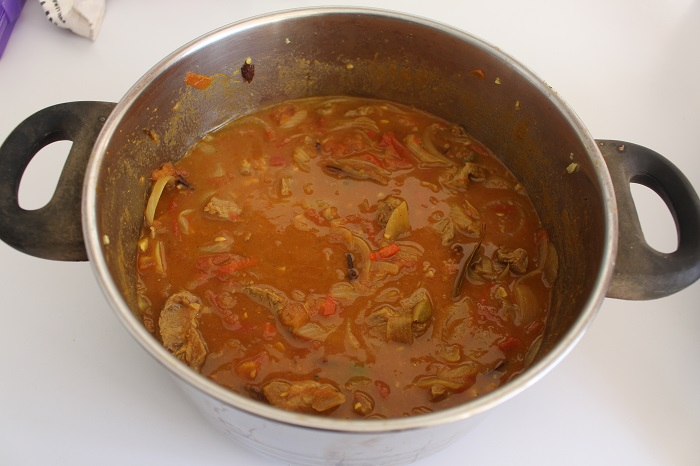

# Rogan Josh \(Lamb\)

This recipe was from a TV cooking show. Everyone loves a lamb rogan josh \(unless you are vegetarian/vegan of course\). 

## Ingredients

* 1kg Shoulder lamb 
* 2 red onions
* 4 cloves garlic
* 5 tbsp. spoons ghee or oil
* 2 bay leaves
* 2 tbsp. fennel seeds
* 2 tbsp. spoon tomato paste
* 1 tbsp. Ginger sliced
* 1 tbsp. turmeric
* 8 cloves \(whole\)
* 1 cup dried whole chilly \(from indian grocer\)
* 1 fresh chilly
* 1 cinnamon stick
* 6 green cardamom pods 
* 3 tbsp. coriander
* 1 tbsp. chilly powder
* 3 tomatoes diced
* Salt

## Cooking instruction

1. Soak big handful of dried whole chillies in hot water for 15 mins.  Blend to make a chiili paste. This will provide color and flavour to the dish.
2. Heat ghee or oil if you don't have ghee into a large pot.
3. Add bay leaves, fennel seeds, green cardomon pods \(slice each pod in half\), cloves, 1 fresh chilli and 1 broken up cinnamon stick.  
4. Add 2 sliced red onions and brown for a few minutes
5. while onions are browning get powdered spices ready \(tumeric, chilli powder, coriander powder\)
6. Once onions have browned add ginger paste, fresh ginger and garlic and stir in.
7. Add powdered spices and 3/4 cup of chilli paste and 1/2 cup water and stir in.
8. Add tomatoes and tomato paste and god pinch of salt.
9. Add 1kg diced lamb \(dice large\) into pot and stir the meat for a couple of minutes to seal.
10. Add 1/2 cup of water and stir in.  
11. Bring curry back to simmer, cover with lid and cook for 30 mins to allow the magic to happen.

