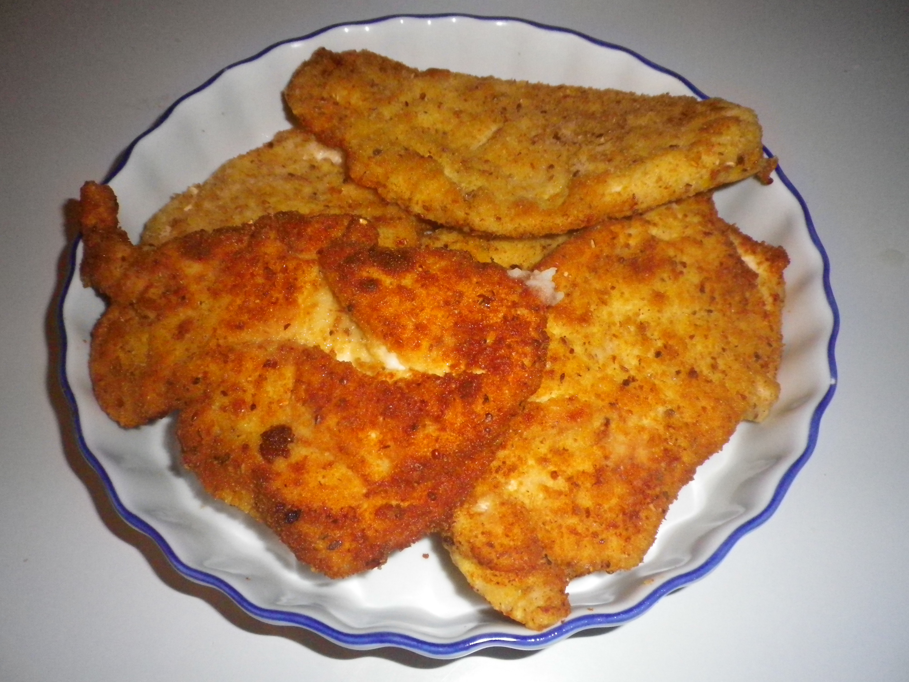

# Schnitzel

Why buy pre crumbed when you can prepare yourself for a fraction of the cost and a lot more yum.

## Ingredients

- veal schnitzel or chicken breast
- 2 eggs
- Salt & Pepper
- oil for shallow frying
- Plain flour
- breadcrumbs
- lemon
                
## Cooking instruction
1. Tenderize the veal orchicken breasts. 
2. Add salt & pepper to meat.
3. Lightly coat meat in flour.
4. Dip in a bowl of egg (beaten).
5. Cover in breadcrumbs.
6. Shallow fry for a couple of minutes & turn over.
