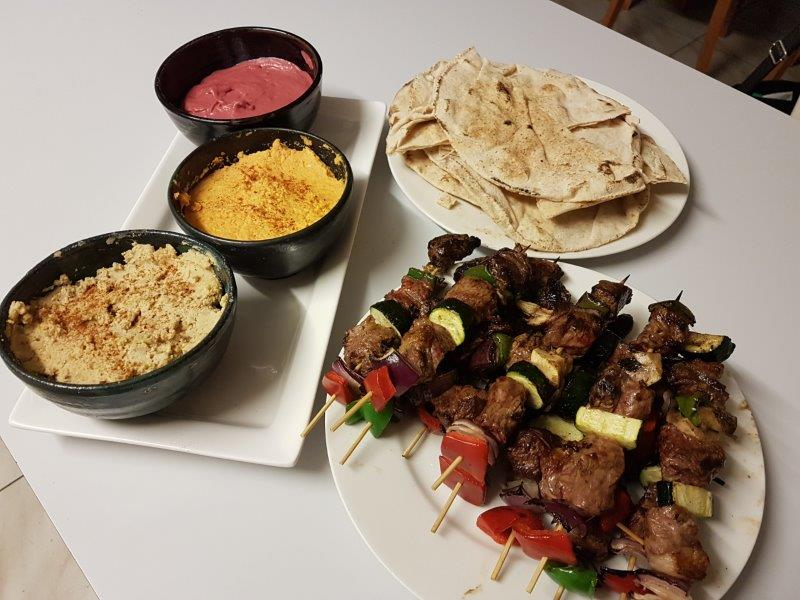

# Skewers and Dips

This banquet style is easy and great to feed the masses. Inspired by Ben's culinary skills

## Meat Skewers Ingredients

* 1kg beaf cuts \(I used scotch fillets but any nice beaf cut works\)
* 1 zuchinni
* 1/2 red capsicum, 1/2 green capsicum
* mushrooms
* skewers

## Dip Roasted Carrot Ingredients \(, Roast Carrot, Hummus\)

* 6 carrots
* 1/4 cup tahini 
* 1 lemon \(juice\)
* 3 cloves garlic
* 1 teaspoon ground cumin
* 1 tablespoon olive oil
* 3 tablespoons milk
* pita bread

## Dip Egyption beetroot Ingredients

* 1/2 small can beetroot
* 1 cup natural yogurt
* 1/2 lemon
* 1/2 teaspoon ground coriander
* 1/2 teaspoon Cumin
* 1/2 teaspoon cinamon
* 1/2 teaspoon paprika

## Dip Hummus Ingredients

* 1 can chickpeas
* 1/4 cup tahini 
* 1/2 lemon
* 3 cloves garlic
* ¼ teaspoon ground cumin
* 1 tablespoon olive oil

## Instructions

1. Cut meat into pieces and marinade with olive oil, salt, pepper and mixed herbs.
2. Cut carrots into 1 inch sized chuncks, toss them in olive oil and salt. Place in baking tray with garlic pieces and roast in 200c oven for 30 mins.
3. In a food processer combine all the cooked carrots, garlic, tahini, lemon juice, cumin and milk and blend until smooth.
4. Serve carrot dip sprinkled with pinch of smoked paprika, parsely or toasted pumpkin seeds.
5. For orher dips, blend ingedients in a food processor. 
6. Soak skewers in cold water for a few minutes
7. Chop zuchinni and coat in roasting pan juices that was used for carrot dip to soak up all that goodness. 
8. Make up the meat skewers and grill on the BBQ 

