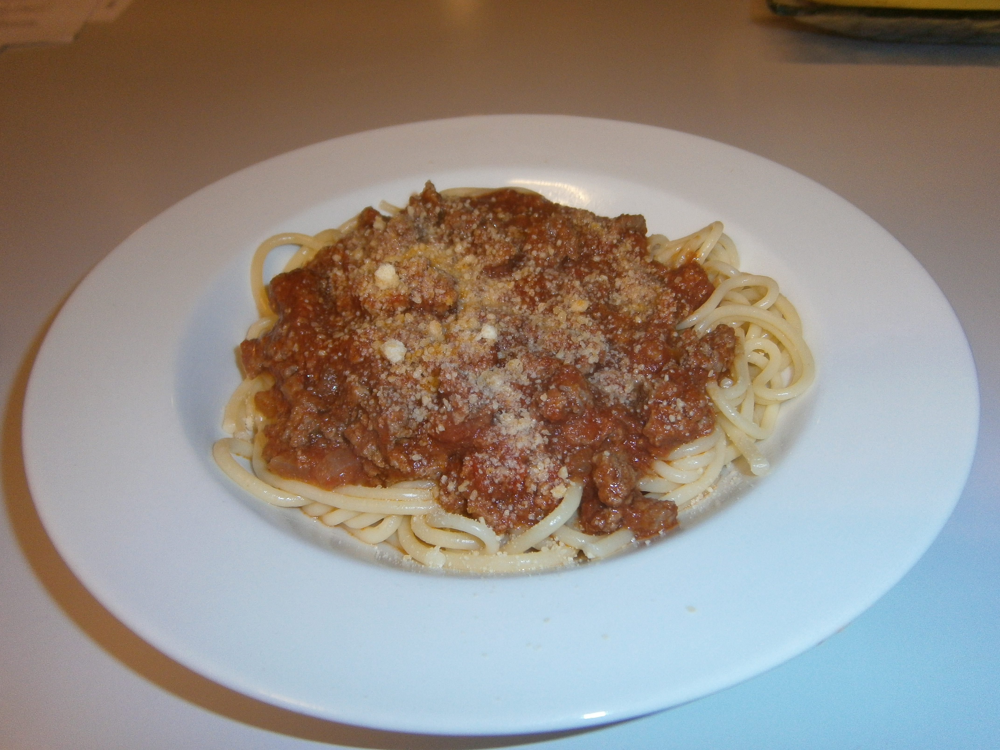

#Spaghetti Bolognese  

## Ingredients
- spaghetti pasta
- 750g premium beef mince
- 1 garlic
- Italian cooking sauce (Bertolli)
- parmesan cheese
- 1 bay leaf
- 1 large onion
- sweet Hungarian paprika
- 1 big spoon tomato paste
- Mixed herbs
- oil
 
## Cooking instruction
1. Sauté chopped onion / garlic with oil in a pan.
1. Add beef mince, salt, pepper & paprika. Brown the meat.
1. Add 1 big spoon tomato paste, 2 cups of Italian cooking sauce.
1. Add 2 cups water, bay leaf, mixed herbs and stir.
1. Add to cooked spaghetti and sprinkle parmesan cheese.
