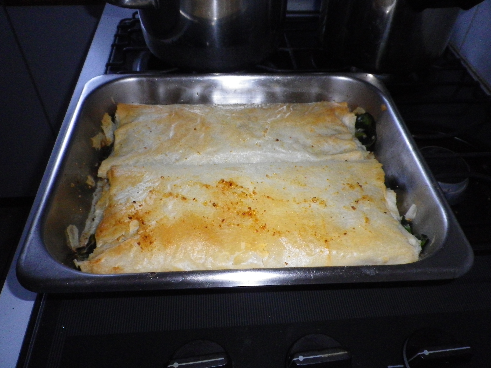

#Spinach & Feta Filo

## Ingredients
- Filo pastry
- Small tub ricotta cheese
- 1 spoon sour cream
- oil
- Feta cheese
- English spinach
- 1 egg
- butter

## Cooking instruction
1. Preheat oven at 180 degrees.
1. Place a tea towel on kitchen bench.
1. Place 2 sheets of filo on tea towel and brush with oil.
1. Keep adding 2 sheets, brush with oil.
1. Repeat until you have around 8 sheets.
1. Add spinach leaves, feta, ricotta to the pastry. (sour cream and 1 beaten egg are optional)
1. Roll the filo pastry up (use tea towel to assist). Keep brushing with ½ oil & ½ melted butter mixture as you roll each part.
1. Rub oil on base of tray and sprinkle bread crumbs on base.
1. Place filo in tray and place in oven (increase to 200 degrees). Bake for 1 hour.
1. Turn tray after 30 minutes (and brush a bit more melted butter on top)

