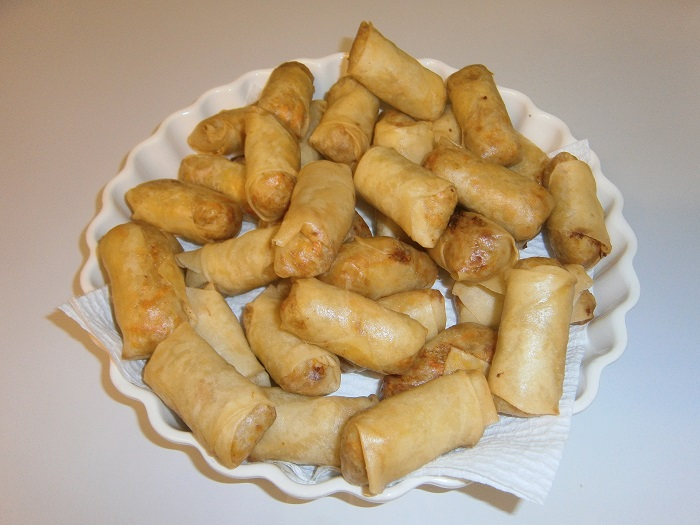

# Spring Rolls Vietnamese

These are great to take to a friends place. They won't last long.

## Ingredients

* Spring Roll pastry \(with eggs\)
* 2 eggs \(1 in mixture, 1 for glue\)
* 500g pork mince
* Oil for deep frying
* 2 large carrots \(grated\)
* ½ onion
* 1 packet vermicelli

## Cooking instruction

1. Rinse vermicelli in hot water for a few minutes. Let it dry off. Chopped vermicelli very fine.
2. Mix all ingredients in a bowl \(1 egg only\). It is best to keep the mixture as dry as possible.
3. Wrap up small amounts of mixture into spring roll wrappers and seal with egg yolk.
4. Deep fry for a few minutes until they start to go brown. Makes about 50 spring rolls.

