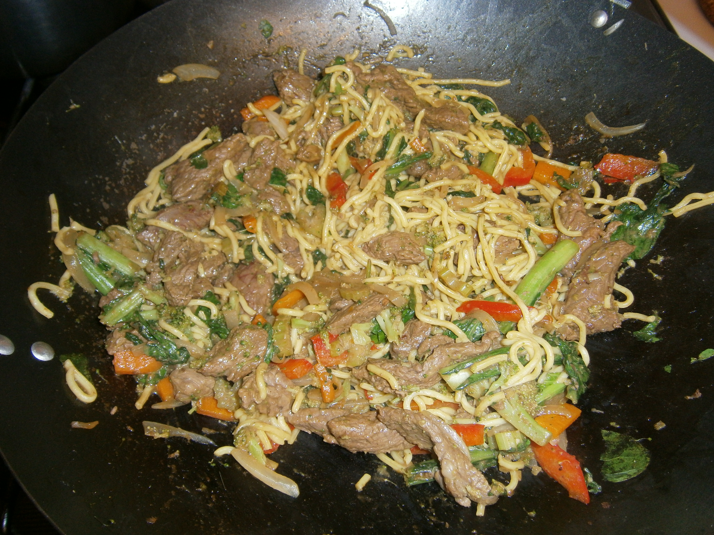

#Stir Fry

## Ingredients
- Fresh egg noodles (thin noodles from asian grocer)
- spinach
- Shallots
- Red capsicum
- Curry powder
- cashews
- Beef strips
- 2 teaspoons grated ginger
- Soy sauce
- 1onion
- Seasonal vegetables

## Cooking instruction
For the perfrct egg noodles.
Microwave the noodles for a few minutes.
Dip noodles in hot water for a few seconds and then allow to dry.
Set aside and add at the end.
Have wok, you know the rest…

