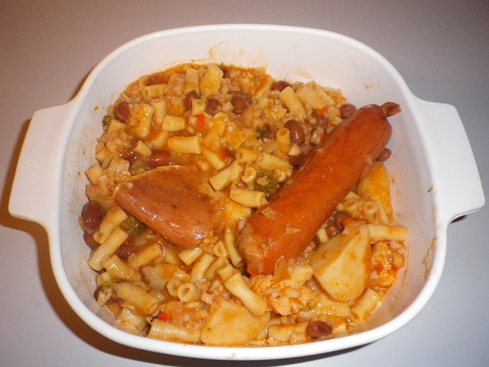

# Varivo \(stew\)

## Ingredients

* 1 ½ cups borlotti beans \(tin\)
* 1 small onion
* ¼ green & ¼ red capsicum
* 1 garlic
* 1 big leaf spinach
* Italian cooking sauce \(Bertolli\)
* 5 sprigs continental parsley
* 1 handful rice
* 2 potatoes
* Macaroni
* 1 bacon
* 3 pieces cauliflower
* 3 pieces broccoli
* 2 kransky
* 3 roma tomatoes
* Hungarian sweet paprika

## Cooking instruction

1. Fill large saucepan/pot ½ full of water and set on medium heat. 
2. Add potatoes, capsicum, onion, cauliflower, broccoli \(all chopped small\).
3. Add kransky, bacon, spinach and 5 sprigs of parsley whole with salt, pepper and start cooking.
4. When water boils add 3 small handfuls of macaroni and 1 small handful of rice.
5. In a small fry pan, add oil, 1 tablespoon flour and stir. When brown add chopped garlic, chopped roma tomatoes and 2 big spoons of Italian cooking sauce. Add to pot.
6. Add Hungarian sweet paprika & 1 vegetable stock cube.
7. Cover with lid on low heat for 30 minutes, stirring occasionally.
8. Add the end add some green peas.

