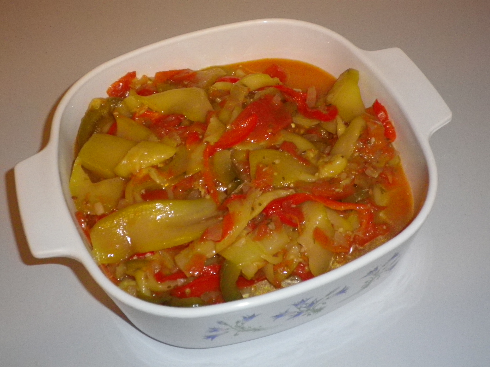

# Capsicum Veggies

This is a really good as a side dish with almost anything and is even better cold.  Also makes a great relish for your sausage sandwiches or hamburgers.

## Ingredients
- 4 zucchinis
- 1 green & red capsicum
- 5 tomatoes  (juicy)
- Pepper steak seasoning

## Cooking instruction
1. Peel & slice zucchini lengthwise in thin slices (the thinner the better), place in a bowl & sprinkle table salt.  Let it sit for 20 minutes.
2. Brown chopped onion & garlic in a medium/large saucepan.
3. Add sliced capsicum & yellow pepper
4. Slice tomatoes and add to saucepan.
5. Add a pinch of pepper steak seasoning & ground black pepper.
6. Strain zucchini by squeezing in hands & add to saucepan.
7. Add Mexican chilli powder & fresh parsley.
8. Stir occasionally for 10-15 minutes keeping the lid on. 
