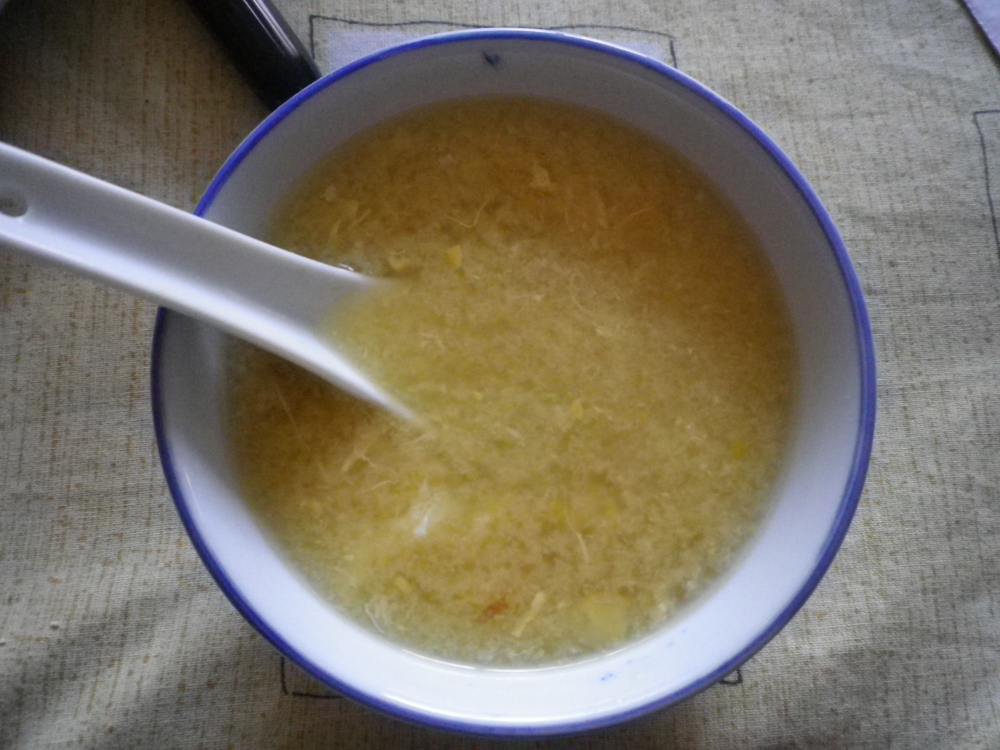

# Chicken & Corn Soup

This is a winter favorite, and a good use of excess chicken stock from previous chicken soup recipe

## Ingredients
- shredded cooked chicken
- 8 cups of chicken stock
- 470g can creamed corn
- 2 slices ham
- 1 chicken stock cube
- Salt & Pepper
- shallots
- Ginger 4 slices
- 2 egg whites
- 2 tbsp. Corn flour

## Cooking instruction
1. Use the chicken stock & chicken from the previous recipe.
2. Combine in a large saucepan the reserved chicken stock, creamed corn, finely chopped ginger, salt, pepper and chopped shallots, and bring to boil.
3. Mix corn flour in a cup with some water to get a smooth paste. Add to soup and stir until soup boils and thickens. Bring to simmer. 
4. Lightly beat egg whites (1 at a time) in a cup with a little bit of water.  Add to soup in a thin stream. I usually stir the soup just before adding the egg whites.
5. Add thinly stripped chicken meat & shredded ham & heat gently.  Top with extra shallots.
