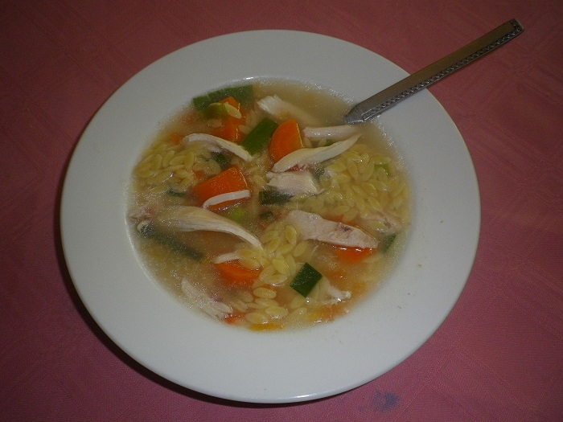

# Chicken Soup

This is a winter favorite for the whole family.  The left over chicken stock can also be used for other dishes.

## Ingredients
- 1 whole large chicken
- 1 celery
- 1 turnip
- 1 chicken stock cube
- Soup pasta (small are best)
- 2 carrots
- 1 onion
- 1 bay leave
- 1 tomato
- Salt & pepper

## Cooking instruction
1. Rinse the chook under water.
2. Cover the chicken in a large pot of cold water.
3. Chop and add all the ingredients.(large chunks)
4. Bring to boil & simmer for 1 ½ hours.
5. Remove cooked chicken.
6. Boil some pasta in a small saucepan of chicken stock.
7. When pasta is cooked, squeeze in a juicy tomato & add some more pepper, fresh parsley and some shredded chicken. 
