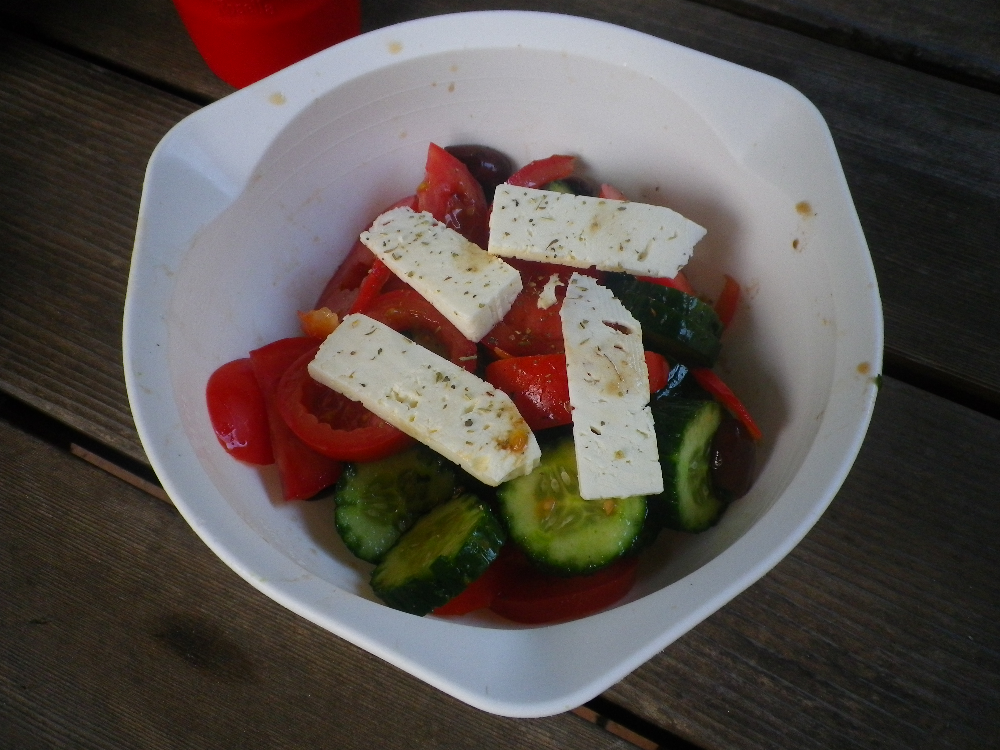

#Greek Salad
This is Jamie Oliver’s recipe, simple and looks great

## Ingredients
- Tomatoes (cherry,roma & big)
- Kalamata olives pitted
- olive oil
- red onion (Spanish)
- green capsicum
- Cucumbers Lebanese
- feta
- Red wine vinegar
- Fresh Dill
- Oregano

## Cooking instruction
1. Cut cherry tomatoes in half, romas in different shapes and big beef tomato in thin slices.  Visually superb.
1. Run a fork length wise on cucumbers before slicing. Again visually superb and allows seasoning to get in.
1. Slice Spanish onion wafer thin and add.
1. Squeeze olives over salad and add in the bowl.
1. Chop some fresh dill (and mint if you have it)
1. Slice capsicum
1. Add red wine vinegar, olive oil
1. Get in and mix it well.
1. Add a big block of feta on top and sprinkle with oregano.

