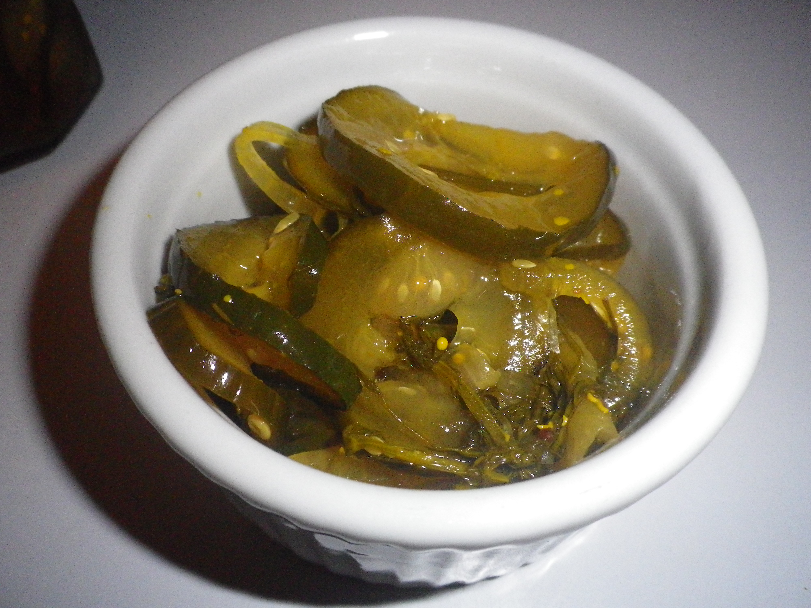

#Pickles
This is my friend Luan’s Vietnamese pickle cucumber recipe (YUM).

## Ingredients
- 5 kg Cucumbers Lebanese
- 1 ½ cup white sugar
- 3 teaspoon mustard seed paste (jar)
- 3 teaspoon turmeric
- 1 ½ cup white vinegar
- 1 ½ cup brown sugar
- 2 Spanish onions (red)
- 2 bunch Fresh Dill
- Oregano
- ½ cup salt

## Cooking instruction
1. Mix salt and water (warm) in a large mixing bowl
1. Add sliced cucumber & onions.
1. Soak overnight & drain liquid
1. In a large pot add vinegar, sugar (brown & white), turmeric and mustard seed.
1. Bring to boil
1. Add cucumber and onion mix & add dill
1. Bring to boil.
1. Pour into jars and seal while hot.

