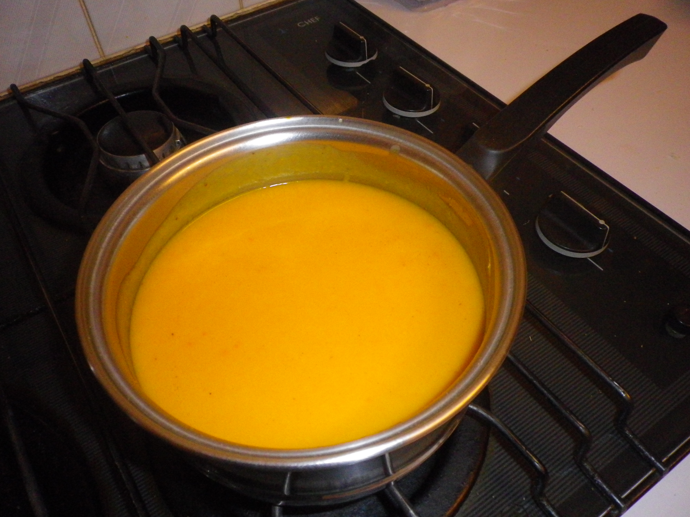

#Pumpkin Soup 

## Ingredients
- pumpkin
- 1 carrot
- 1 teaspoon nutmeg 
- 1 slice red capsicum
- Chicken or veg stock
- ½ onion

## Cooking instruction
1. Boil pumpkin & carrot pieces in chicken stock.
1. Add finely chopped capsicum at the end.
1. Blend the mixture.  Add a pinch of nutmeg at the end.
